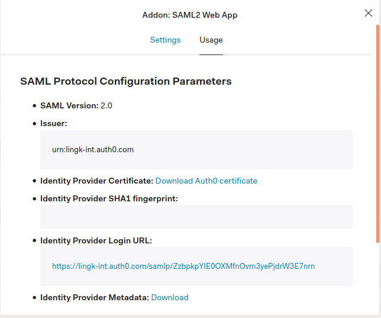

# DocuSign Connect

For running the application we need 2 files 1st is yaml configuration, below is the sample yaml file and 2nd `metadata.xml` which you will get after SAML configuring, below is the sample yaml file

### YAML configuration:
```yaml
authn:
  saml:
    metadataLocal: ./metadata.xml # path for identity provider’s metadata XML file. 
    issuerId: urn:test-int.auth0.com # The identity of the application registered with the SAML provider.
    signatureDigest: http://www.w3.org/2000/09/xmldsig#rsa-sha1 # Default: SHA1. Digest algorithm to sign SAML messages (optional). Valid values include "SHA1", "SHA256", "SHA384", "SHA512", "RIPEMD160" and "MD5".

# Lingk clientId and secret to get DocuSign credentials
lingkProject:
  clientId: # id required to get docusign credentials
  clientSecret: # Secret required to get docusign credentials
  environmentKey: testdedup # lingk environment 
  entrypoint: https://internal.lingkto.com # base url of lingk for getting the credentials

# This is requry only if you want to fetch more data which is not in SAML assertion 
# Below is the sample provider from which more data need to be fetched
providers:
- name: postgres # name of the provider, it should be same as specified in envelopes tabs configuration below
  server: 172.17.0.2 # host server to make the db connection
  database: lingk # Database name
  userName: postgres # Username require for connecting to db
  password: Pass2020! # Password reqire to make the db connection
  port: 5432 # optional, Port on which db is exposed

# configure your prefill embed URLs
envelopes:
- template: 76a8d521-27dd-4767-bdac-0f74bb65dff4  # Template id for which envelope need to be created, this you will get when configuring template in docusign 
  url: /addDrop # url based on which this template will be selected
  docusignReturnUrl : https://localhost:3002?state=123 # Redirect to this url after completing docusign signing process
  linkFromSamlToProvider: nameidentifier|userIdentifier # This is required to fetch data from provider, first field will be name of saml identifier and second field will be provider identifier, this will form the where clause for example for above configuration it will be 'Where  userIdentifier=[nameidentifier(value of nameidentifier from saml, only id)]'
  tabs:
    - id: permAddress # tab
      provider: postgres # provider name for which connection need to be made
      table: userinfo # required in case of diffrent provide eg. Postgres
      sourceDataField: address # field name in give table from where data need to be shown on template
    - id: presentAddress       
      provider: postgres
      table: userinfo
      sourceDataField: address
    - id: nameLabel
      provider: saml
      sourceDataField: name      
    - id: visionLabel 
      provider: saml
      sourceDataField: emailaddress
- template: 066a58a7-c1f1-4f1f-ab33-ddacc16f2409
  url: /salaryForm
  docusignReturnUrl : https://www.docusign.com/
  tabs:
    - id: legalNameLabel 
      sourceDataField: name
    - id: familiarNameLabel 
      sourceDataField: name
    - id: familiaraNameLabel 
      sourceDataField: name
```
One's the yaml configuration and saml metadata file are created you need to pass that while creating docker build or if you are running the application locally then copy the file directly to root folder.

### Metadata Location in oauth:  

<br/>
<br/>
### How to run

### For running on local

```bash
 ASPNETCORE_YAML_CONFIG=test.yaml dotnet run --urls="https://localhost:3002"
 ```
### For running using docker

```bash
docker build --build-arg YAML_CONFIG_PATH=./test.yaml --build-arg METADATA_PATH=./metadata.xml   -t lingk_redirectore:0.0.1 .
```

#### For linux  
  
  
Generate Certificate: 

```bash
dotnet dev-certs https -ep ${HOME}/.aspnet/https/aspnetapp.pfx -p { password here }
dotnet dev-certs https --trust
```

Run docker image:

```bash
docker run --rm -it -p 3000:80 -p 3002:443 -e ASPNETCORE_URLS="https://+;http://+" -e ASPNETCORE_HTTPS_PORT=8001 -e ASPNETCORE_Kestrel__Certificates__Default__Password="test" -e ASPNETCORE_YAML_CONFIG="test.yaml" -e ASPNETCORE_Kestrel__Certificates__Default__Path=/https/aspnetapp.pfx -v ${HOME}/.aspnet/https:/https/ lingk_redirectore:0.0.1  
```

#### For Windows

Generate Certificate: 

```bash 
dotnet dev-certs https -ep %USERPROFILE%\.aspnet\https\aspnetapp.pfx -p { password here }
dotnet dev-certs https --trust
```

Run docker image:

```bash
docker run --rm -it -p 3000:80 -p 3002:443 -e ASPNETCORE_URLS="https://+;http://+" -e ASPNETCORE_HTTPS_PORT=8001 -e ASPNETCORE_Kestrel__Certificates__Default__Password="test" -e ASPNETCORE_YAML_CONFIG="test.yaml"  -e ASPNETCORE_Kestrel__Certificates__Default__Path=/https/aspnetapp.pfx -v %USERPROFILE%\.aspnet\https:/https/ lingk_redirectore:0.0.1
```
<br/>
<br/>

###  How to browse the application:
You can browse the application by hitting `https://localhost:3002`  
Remember to add /path at end of the url to generate the envelope
<br/>
<br/>

## DocuSign References:
Docusign envelope recipient tabs resource https://developers.docusign.com/docs/esign-rest-api/reference/envelopes/enveloperecipienttabs/#tab-types/  
Recipients resources : https://developers.docusign.com/docs/esign-rest-api/esign101/concepts/recipients/
<br/>
<br/>

# Resources:
* Hosting ASP.NET Core images with Docker over HTTPS https://docs.microsoft.com/en-us/aspnet/core/security/docker-https?view=aspnetcore-5.0